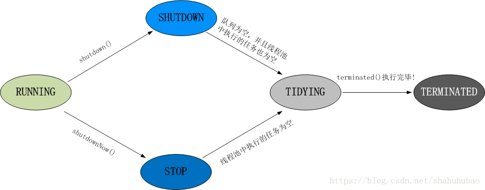

### 线程池的创建
- 线程在Android中是个很重要的概念，线程分为主线程和子线程，主线程处理  界面相关事情，子线程用于执行耗时操作。Thread、AsyncTask、IntentService、HandleThread
     - 传统线程的缺陷：
        - 1.在任务众多的情况下，系统要为每一个任务创建一个线程，而任务执行完毕后会销毁线程，所以会造成线程频繁地创建和销毁
        -  2.多个线程频繁地创建会占用大量资源，并且在资源竞争的时候容易出现问题，同时这么多线程缺乏一个统一的管理，容易造成页面的卡顿
        - 3.多个线程频繁地销毁，会频繁调用GC机制，这会使性能降低，由非常耗时；
     所以需要线程池来管理线程
     - 优点：
        - 1.可以重用，避免多次创建和销毁；
        - 2.有效控制线程池的最大并发数，避免大量线程抢占资源；
        - 3.对多个线程统一管理，可提供定时执行及指定间隔循环执行的功能
- 创建线程池的方式
    - ThreadPoolExecutor threadPoolExecutor = new ThreadPoolExecutor(3, 5, 1, TimeUnit.SECONDS, new LinkedBlockingDeque<>(25));参数分别是：核心线程数、最大线程数、队列个数；
    - 2.ExecutorService service = Executors.newFixedThreadPool(5);特点：参数为核心线程数，只有核心线程，并且阻塞队列无界；使用执行长期的任务，性能好很多；
    - 3.CachedThreadPool (按需创建)特点：没有核心线程，只有非核心线程，并且每个非核心线程空闲等待的时间为60s，采用SynchronousQueue队列。适用：执行很多短期异步的小程序或者负载较轻的服务器
    - 4.ScheduledThreadPool(定时延时执行)特点：它可以安排在给定延迟后运行或者定期的执行；
    - 5.newSingleThreadExcutor:线程池中只有一个工作线程，可保证顺序的执行各个任务；

### 如何终止一个线程
    - 调用interrupt()，然后在run()方法中，判断是不是中断状态，如果是就终止线程；注意：当需要被中断的线程是阻塞状态。外部调用thread.interrupt()，会抛出InterruptedException异常。

### 内存泄漏检查工具
- LeakCanary原理
    - install()方法：listenerServiceClass方法传入了展示分析结果的service（DisplayLeakService）；excluedRefs方法排除了开发中可以忽略的泄露路径，buildAndInstall是主要的函数，实现了activity是否能被释放的监听，buildAndInstall会调用ActivityRefWatcher.install来监听Activity，最终调用watchActivities(), watchActivities方法中通过RegisterActivityLifecycleCallbacks来监听Activity生命周期-->当Activity被销毁时，回调onActivityDestroyed，然后最终调用RefWatcher.watch()方法
    - 监测机制利用了java的WeakReference和ReferenceQueue，通过将Activity包装到弱引用中，如果activity被回收，就会出现在ReferenceQueue中，通过检测ReferenceQueue里面的内容来检查Activity是否被回收
        - 1.首先通过removeWeaklyReachableReference来移除已经被回收的Activity的引用；
        - 2.通过gone(reference)判断当前弱引用的对应的Activity是否已经被回收，已收回直接返回即可；
        - 3.如果没有被回收，将调用GcTigger.runGc方法运行GC，GC完成后在运行第一步，然后运行第二步判断Activity是否被回收了，如果还没有被回收，说明Activity已经泄漏；
        - 4.如果Activity泄漏了，就抓取内存dump文件(Debug.dumpHprofData)
        - 5.之后通过HeapAnalyzerService.runAnalysis进行分析内存文件，接着通过HeapAnalyzer(checkForLeak--> findLeakingReference--findLeakTrace)来进行内存泄漏分析；
        - 6.最后通过DisplayLeakService进行内存泄露的展示。

### 应用保活

### 插件化

### 性能优化
- 1.UI绘制，主要原因是绘制层级深、页面复杂、刷新不合理，措施：减少布局层级和不合理的刷新；
- 2.数据处理：
    - 原因分析：
        - 1.数据在主线程处理；
        - 2.数据处理占用CPU高，导致主线程拿不到时间片；
        - 3.内存增加导致GC频繁；

- 措施：
    - 1.不要在主线程进行网络请求/大文件的IO操作；
    - 2.绘制UI时，尽量减少UI层级，减少不必要的view嵌套；
    - 3.布局使用的时FrameLayout时，可以把它改成merge，可以避免自己的帧布局和系统的ContentFrameLayout帧布局重叠造成重复计算（measure和layout）；
    - 4.在view层级相同的情况下，尽量使用LinearLayout而不是RelativeLayout；因为RelativeLayout在测量的时候会测量二次，而LinearLayout测量一次；
    - 5.合理的刷新机制，尽量减少刷新次数，缩小刷新区域；
- 3.安装包大小优化：随着功能不断增加，APP包肯定不断地变大，但应用的安装包越大，用户下载的门槛越高
    - res资源优化
        - 只是用一套图片，使用高分辨率的图片；
        - UI设计在Ps安装TinyPNG插件，对图片无损压缩；
    - 代码优化：
        - 实现功能模块的逻辑简化；
        - 移除无用依赖
    - lib资源优化：
        - 1.动态下载的资源
        - 2.一些模块的插件化动态添加；
        - 3.so文件的剪裁和压缩
    - assets资源优化：
        - 1.音频文件最好使用有压缩的格式，比如采用opus、MP3等格式；
    - 代码混淆：
        - 使用proGuard代码混淆器工具，它包括压缩、优化、混淆等功能
### Retrofit处理https请求
- 问题描述：一些通过CA认证的，https是可以直接访问的，但一些自签名证书，用retrofit直接访问则会走到onFailure里,错误信息是无法通过证书验证。
-     首先把证书放到assets下面。如果你是chrome浏览器的话，请按CTRL+SHIFT+I打开开发者工具，点击Security->View certificate->详细信息->复制到文件

### 线程池
- 线程池的七个参数
    - 1.corePollSize：线程池核心线程的大小；
    - 2.maximunPoolSize：线程池最大线程数量；
    - 3.keepAliveTime：线程存活时间；
    - 4.unit空间线程存活时间单位；
    - 5.workQueue：工作队列，阻塞队列；
    - 6.threadFactory：线程工厂；
    - 7.handler拒绝策略；

- ThreadPoolExecutor.execute(Runnable r)的功能就是：
    - 1.将任务添加到阻塞队列workQueue，workQueue.offer(command);
    - 2.根据core和maxPool，选择是否创建Worker，addWorker；
- addWorker分为两部分：1.创建；2.启动worker
    - 创建worker：获取ThreadLocal的全局锁，安全的创建Worker；然后t.start();
    - worker实现了Runnable接口，重写run方法，getTask从线程池中，获取任务，线程使用一个hashSet来存储的，线程池启动多个Worker去执行任务，每个Worker不停的从阻塞队列中取出任务，直到所有的任务执行完毕；
    
- 1.Running：
    - 状态说明：线程池处于Running状态时，能够接收新任务，以及对已添加的任务进行处理；线程池一旦被创建就一直时Running状态；
- 2.ShutDown：
    - 线程池处在ShutDown状态时，不接受新任务，但能处理已添加任务；
    - 状态切换：调用线程池的shutDown()接口时，变为shutdown状态
- 3.STOP：
    - 不接受新任务，不处理任何任务，并且会中断正在处理的任务；
    - 调用线程池的shutDownNow(), 切换状态至STOP；
- 4.TIDYING：
    - 当所有任务终止时，ctl记录的任务数量为0，线程池会变为TIDYING状态
- 5.TERMINATED
    - 线程池彻底终止，变成terminated状态
    - Tidying--> Terminated
### 原子性、可见性
- 原子性：
    - 原子性是指该操作时不可再分的，同一时刻只能有一个线程来对它进行操作。简而言之，在整个操作过程中不会被线程调度器中断的操作，都可认为时原子性。比如a=1;
- 可见性
    - 一个线程对共享变量的修改，能够及时的被其他线程看到；
    - 在多线程的情况下，共享变量不一定时可见的，要想实现变量可见，可以使用synchronized、volatile两种方式。
- Java内存模型
    - 所有的变量都存储在主内存中；
    - 每个线程都有自己独立的工作内存，里面保存该线程使用到的变量的副本
- 共享变量要实现可见性，必须经过如下两个步骤
    - 1.把工作内存1中更新过的共享变量刷新到主内存中；
    - 2.把主内存中最新的共享变量的值更新到工作内存2中；
### Handler的泄漏
- 在Activity中写Handler时，会提示内存泄露的可能；
- 内部类和匿名内部类会持有外部类的实例，静态内部类不持有外部类的实例；
- 在Activity中new Handler重写HandleMessage有可能会导致内存泄漏，原因：Activity finish了，handler还持有activity对象，导致activity不能回收；解决方案：自定义一个Handler,并静态内部类的形式在Activity中，构造方法传入Activity，并在构造方法中用弱引用包装下这个Activity；

### 静态代理和动态代理 
- 静态代理：创建一个接口，创建被代理类实现该接口，之后在创建一个代理类，同时也实现这个接口，在代理类中持有一个被代理类的对象，而后在代理类的方法中调用该对象的方法；
- 动态代理：动态代理与静态代理相比较，最大的好处是接口中声明的所有方法都被转移到调用处理器一个集中的方法中处理（InvocationHandler.invoke）。这样，在接口方法数量比较多的时候，我们可以进行灵活处理，而不需要像静态代理那样每一个方法进行中转。而且动态代理的应用使我们的类职责更加单一，复用性更强

### Android文件存储
- 内部存储：
    - 内部存储空间：data/data/包名
        - 1.创建一个实现了序列化的对象，让该对象可以通过流写入；
        - 2.创建读入流，FileInputStream inputStream = openFileInput("hxy.txt");读入之前写入的文件；
    - SharedPreference：edit.apply()和edit.commit(),apply()是异步的，commit()是同步的，写入文件是IO操作，所以即使写入量很小，为了不阻塞UI线程，一般还是使用apply()方式提交；
    - 数据库存储：通过原生的SQLiteOpenHelper 调用getWriteableDatabase或者getReadableDatabase()方法获取到SQLiteDatabase然后再增删改查。其数据库.db文件，默认保存在内部存储空间的databases文件夹中。
    - ContentProvider：Android系统中能实现所有应用程序共享的一种数据存储方式，由于数据通常在各应用间是互相私密的，所以次存储方式较少使用，但是又是必不可少的一种存储方式。例如音频、视频、图片、通讯录，一般都可以都可以采用这种方式存储，每个contentProvider都会对外提供一个公共的URI，如果需要数据共享时，每个ContentProvider都会对外提供一个公共的URI，然后其他应用程序就通过ContentProvider传入这个URI来对数据进行操作。
### .equal()和==的区别
- 1.首先，equal和==最根本的区别在于equal是一个方法，而==是一个运算符；
- 2.==运算符比较的是在内存中的物理地址，equal()比较的是哈希算法值是否相等（即hashcode）
